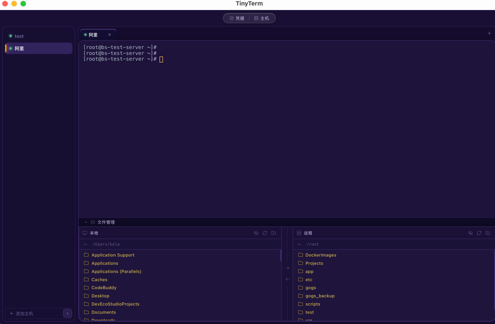

# TinyTerm


TinyTerm 是一个基于 Tauri + React 的桌面 SSH 客户端，主打轻量、好看、可用。

## 主要功能

- 多主机管理（Host）
- 凭据管理（密码 / 私钥）
- 多标签终端会话
- 本地/远端双栏文件管理
- 文件与目录上传下载
- 目录传输自动降级（远端无 tar 时使用递归 SFTP）

## 快速开始

### 环境要求

- Node.js 18+
- Rust（含 Cargo）

### 安装依赖

```bash
npm install
```

### 开发运行

```bash
npm run tauri dev
```

### 构建发布

```bash
npm run tauri build
```

## 常用命令

```bash
npm run typecheck
npm run test
npm run build
npm run check:bundle-size
```

## Docker 测试

### 普通测试容器

```bash
cd docker-test
docker build -t tinyterm-test .
docker run --rm -d --name tinyterm-test -p 2222:22 tinyterm-test
```

连接信息：

- Host: 127.0.0.1
- Port: 2222
- Username: testuser
- Password: test123

### 无 tar 降级测试容器

```bash
docker build -t tinyterm-test-no-tar -f docker-test/no-tar/Dockerfile .
docker run --rm -d --name tinyterm-no-tar -p 2223:22 tinyterm-test-no-tar
```

连接信息：

- Host: 127.0.0.1
- Port: 2223
- Username: testuser
- Password: test123

清理容器：

```bash
docker rm -f tinyterm-test tinyterm-no-tar
```

## 目录结构（简版）

```text
tinyterm/
├── src/          前端（React + TypeScript）
├── src-tauri/    后端（Rust + Tauri）
├── docker-test/  测试容器
└── docs/         文档
```

## 许可证

MIT
